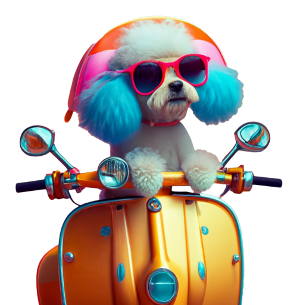

<!DOCTYPE html>
<html lang="en">
  <head>
    <meta charset="UTF-8" />
    <meta name="viewport" content="width=device-width, initial-scale=1.0" />
    <title>Happy Dogo</title>
    <link rel="preconnect" href="https://fonts.googleapis.com" />
    <link rel="preconnect" href="https://fonts.gstatic.com" crossorigin />
    <link
      href="https://fonts.googleapis.com/css2?family=Inter:ital,opsz,wght@0,14..32,100..900;1,14..32,100..900&display=swap"
      rel="stylesheet"
    />
    <link rel="stylesheet" href="./hero.css" />
    <link rel="stylesheet" href="./nav.css" />
    <link rel="stylesheet" href="./typography.css" />
  </head>
  <body>
    <header>
      

        

          <nav class="navigation flex">
            

              
            

            <ul class="middle-list flex inter-w400 text-sm">
              <li><a href="#">Home</a></li>
              <li><a href="#">About</a></li>
              <li><a href="#">Services</a></li>
              <li><a href="#">Training</a></li>
              <li><a href="#">Shop</a></li>
            </ul>
            

              <a class="flex" href="mailto:Happydoggo@email.com"
                >Contact us</a>
            

          </nav>
        

      

    </header>
    <section id="hero">
      

        

          
Welcome...

          <h1 class="text-xxl inter-w300 text-white">
            Warmth and comfort for
            your furry friends
          </h1>
          

            Discover the perfect pet heating solutions to keep your beloved
            companions cozy and content all year round.
          

          

            <a class="btn text-xs text-white inter-w300" href="">Our services</a>
            <a class="text-white text-xs inter-w300" href="tel:+37060000000"
              >Schedule a call</a>
          

        

        

          

            
            
            
            
            
            
          

        

      

    </section>
  </body>
</html>
